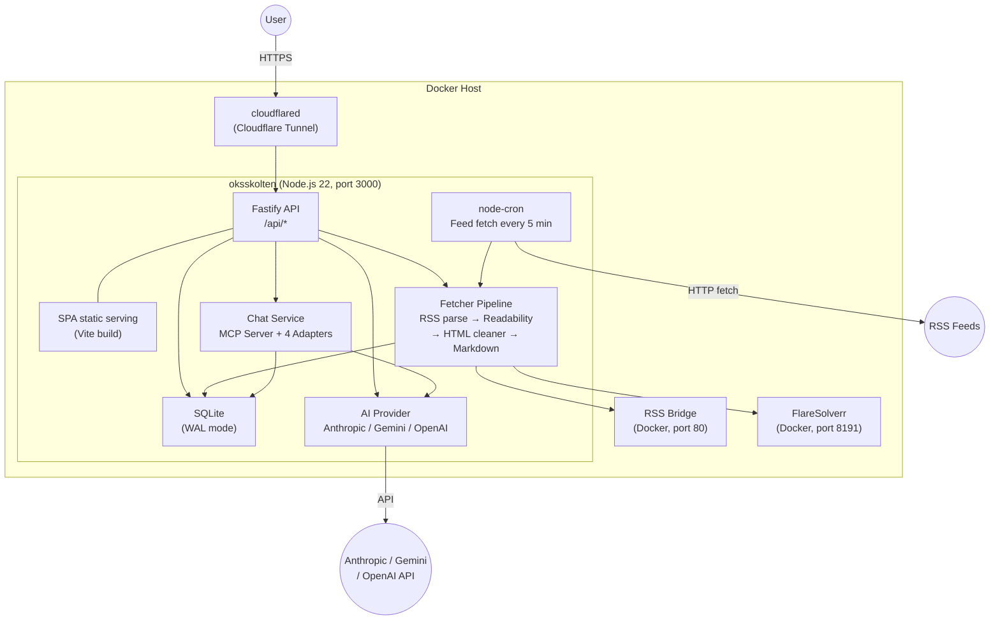

<p align="center">
  <picture>
    <source media="(prefers-color-scheme: dark)" srcset="https://assets.babarot.dev/files/2026/03/aeeb41766d888243.png">
    <source media="(prefers-color-scheme: light)" srcset="https://assets.babarot.dev/files/2026/03/c11e0ce04f0d06e6.png">
    
  </picture>
</p>

<p align="center">
  <a href="https://github.com/babarot/oksskolten/actions/workflows/test.yaml"></a>
  <a href="https://github.com/babarot/oksskolten/actions/workflows/test.yaml"></a>
  <a href="https://github.com/babarot/oksskolten/actions/workflows/test.yaml"></a>
</p>

<p align="center">
  <strong>Oksskolten</strong> <em>(se prononce "ooks-SKOL-ten")</em> — chaque article, en texte intégral, par défaut.
</p>

<p align="center">
  <a href="README.md">English</a> · <strong>Français</strong>
</p>

> Ceci est un fork de [babarot/oksskolten](https://github.com/babarot/oksskolten). Tout ce qui suit décrit le projet amont ; [Ajouts du fork](#ajouts-du-fork) liste ce que ce fork ajoute par-dessus, et [`FORK.md`](FORK.md) documente chaque ajout en détail (en anglais).

## Pourquoi Oksskolten ?

La plupart des lecteurs RSS affichent ce que le flux leur donne — un titre, parfois un résumé. Certains (Miniflux, FreshRSS) savent récupérer le texte intégral, mais c'est à activer flux par flux et à configurer. Oksskolten le fait automatiquement pour chaque article : il récupère l'article d'origine, en extrait le texte intégral avec Readability de Mozilla et 500 motifs de nettoyage, le convertit en Markdown propre et le stocke localement. Aucun réglage par flux, aucun sélecteur CSS à écrire.

Parce qu'Oksskolten dispose toujours du texte complet, les résumés et traductions par IA produisent des résultats qui ont du sens, la recherche plein texte couvre réellement tout, et vous n'avez jamais besoin de quitter l'application pour lire un article.

## Le voir en action

🕺 Démo en ligne → [demo.oksskolten.com](https://demo.oksskolten.com)

<p align="center">
  <picture>
    <source media="(prefers-color-scheme: dark)" srcset="docs/images/screenshots/home-default-dark.png">
    <source media="(prefers-color-scheme: light)" srcset="docs/images/screenshots/home-default-light.png">
    
  </picture>
  <picture>
    <source media="(prefers-color-scheme: dark)" srcset="docs/images/screenshots/inbox-default-dark.png">
    <source media="(prefers-color-scheme: light)" srcset="docs/images/screenshots/inbox-default-light.png">
    
  </picture>
  <picture>
    <source media="(prefers-color-scheme: dark)" srcset="docs/images/screenshots/article-chat-default-dark.png">
    <source media="(prefers-color-scheme: light)" srcset="docs/images/screenshots/article-chat-default-light.png">
    
  </picture>
  <picture>
    <source media="(prefers-color-scheme: dark)" srcset="docs/images/screenshots/appearance-default-dark.png">
    <source media="(prefers-color-scheme: light)" srcset="docs/images/screenshots/appearance-default-light.png">
    
  </picture>
</p>

## Fonctionnalités

- **Extraction du texte intégral** — Chaque article est récupéré à sa source puis passé dans Readability et 500 motifs de nettoyage. Vous lisez des articles complets dans Oksskolten, sans jamais avoir à ouvrir le site d'origine
- **Résumé et traduction par IA** — Traitement à la demande via Anthropic, Gemini ou OpenAI, en streaming SSE. Le traitement porte sur le texte intégral, pas sur les extraits du flux
- **Chat interactif** — Conversations IA multi-tours outillées par MCP : chercher des articles, obtenir des statistiques, poser des questions sur vos flux
- **Recherche plein texte** — Recherche propulsée par Meilisearch sur l'intégralité de vos archives
- **Récupération intelligente** — Planification adaptative par flux, requêtes HTTP conditionnelles (ETag/Last-Modified), déduplication par empreinte du contenu, backoff exponentiel et suppression des paramètres de tracking
- **PWA** — Lecture hors ligne, synchronisation en arrière-plan, installation sur l'écran d'accueil
- **Authentification multiple** — Mot de passe, Passkey (WebAuthn) et OAuth GitHub, chacun configurable indépendamment
- **Gestion de flux intelligente** — Découverte automatique, flux par sélecteur CSS (via RSS Bridge), contournement anti-bot (FlareSolverr) et désactivation automatique des flux morts
- **Clipping d'articles** — Enregistrer n'importe quelle URL comme article, avec extraction complète du contenu
- **Thèmes** — 14 thèmes de couleurs intégrés, import de thèmes personnalisés en JSON, 9 polices d'article, 8 styles de coloration syntaxique
- **Un seul conteneur** — L'API, le SPA et le planificateur cron tournent dans un unique conteneur Docker

## Ajouts du fork

Les ajouts vivent dans de nouveaux fichiers, avec seulement de petits points d'insertion dans les fichiers amont : la synchronisation avec l'amont reste peu coûteuse. [`FORK.md`](FORK.md) détaille chaque élément, jusqu'aux fichiers amont touchés.

### Expérience de lecture

- **La Une** — `/` est une page d'accueil façon journal : un article à la une choisi par score, puis les meilleurs articles non lus de chaque catégorie. L'écran d'accueil orienté chat qu'elle remplace reste accessible sur `/chat`
- **Onglets de catégories** — une barre de sections horizontale au-dessus des listes d'articles (Inbox, puis un onglet par catégorie, avec le nombre de non-lus par catégorie)
- **Barre d'onglets en bas** — navigation basse façon application de presse (Inbox, Recherche, À lire plus tard, Chat, Menu), affichée quand la sidebar est fermée. L'état replié de la sidebar est désormais conservé d'un rechargement à l'autre
- **Navigation par swipe** — balayer vers la gauche ou la droite, ou utiliser les flèches du clavier, pour parcourir la liste d'où vous venez
- **Marquer comme lu sans ouvrir** — un bouton de validation sur chaque carte non lue, dans les cinq mises en page. Sur mobile, balayer une carte vers la droite fait la même chose
- **Les vidéos intégrées ne disparaissent plus** — une vidéo intégrée à l'article était supprimée à l'extraction, ne laissant que sa légende ; elle devient une carte cliquable. Avec l'archivage vidéo activé, un bouton sur l'article en conserve une copie, pour que l'article reste complet même si la source la supprime (nécessite `yt-dlp`)
- **Articles hébergés dans une page imbriquée** — quand une page se révèle être une coquille dont le texte se trouve dans une iframe (un Space Hugging Face, une liseuse de documents) ou à un meta refresh / lien AMP de distance, le récupérateur suit ce pointeur une fois et lit le texte là où il est, en conservant le titre et l'image de la page enregistrée
- **L'image à la une survit** — les thèmes façon WordPress (dont Hackaday) placent l'image à la une dans l'en-tête du billet, que l'extraction jette : la liste affichait une vignette absente du corps de l'article. Quand le corps extrait s'ouvre sans image, l'`og:image` de la page est rétablie en tête d'article
- **Thème Le Monde** — un thème personnalisé importable, inspiré de l'application du journal (`custom-themes/le-monde.json`)

### Chaîne IA sur modèle local

En amont, l'IA tourne à la demande, un article à la fois. Ce fork ajoute une file d'attente persistante en arrière-plan (`server/fetcher/ai-queue.ts`) qui survit aux redémarrages : le travail en attente est marqué en base, repris au début de chaque cycle de récupération avec un backoff de 10 minutes, et traité par lots bornés sur un point d'accès vLLM local.

- **Traduction automatique à la récupération** — tout article dont la langue détectée diffère de votre langue cible est traduit en arrière-plan. La portée est réglable : corps et titre, ou titres seulement — moins coûteux, et la seule option encore utile quand l'extraction du corps a échoué. La détection utilise franc-min, et le français est disponible comme langue cible
- **Résumé automatique à la récupération** — les résumés sont générés à l'arrivée des articles plutôt qu'au clic
- **Filtre de pertinence IA par flux** — donnez un critère à un flux, avec vos mots, et chaque nouvel article est jugé sur ce critère. Les articles rejetés sont masqués, jamais supprimés : un mauvais critère est réversible

### D'autres types de flux

- **Releases des dépôts favoris GitHub** — collez `https://github.com/stars/<user>` pour obtenir un flux unique regroupant les releases de tous les dépôts que ce compte a mis en favori. Une requête GraphQL par tranche de 100 dépôts, avec un mélange release / pre-release / tag configurable. Voir [`86_feature_github_releases.md`](docs/spec/86_feature_github_releases.md)
- **Recherches sociales comme flux** — les feeds personnalisés, profils et recherches Bluesky, ainsi que les hashtags Mastodon, deviennent chacun un flux. La recherche Bluesky demande un mot de passe d'application ; le reste fonctionne sans compte
- **Articles Reddit, correctement** — le corps provient du JSON du post lui-même, y compris le post parent embarqué d'un crosspost, et les meilleurs commentaires sont affichés sous l'article avec un bouton de traduction à la demande. Les récupérations passent par cinq stratégies d'accès successives, parce que Reddit bloque les requêtes anonymes depuis beaucoup d'IP résidentielles

### Gestion et diagnostic des flux

**Réglages → Feeds**, un onglet vide marqué « en développement » en amont, contient maintenant deux sections :

- **Diagnostic** — les flux en échec ou désactivés, chacun avec l'étage du pipeline qui a cassé, la cause probable en clair, l'erreur brute à un clic, et des boutons de re-détection, nouvelle tentative et réactivation. `Retry all` réactive et re-récupère toute la liste
- **Table de gestion** — chaque abonnement avec son nombre d'articles, de non-lus, sa cadence hebdomadaire, la date du dernier article et son état. Recherche, tri sur toutes les colonnes, filtres par catégorie et par état, et sélection (Maj+Clic pour une plage) pour déplacer, récupérer, marquer comme lu, réactiver ou supprimer en masse

### Outillage et corrections

- **Tests E2E** (`npm run test:e2e`) — Playwright build l'application, démarre le vrai serveur sur une base jetable et vérifie la une, le parcours inbox → lecteur et la barre d'onglets mobile
- **Sauvegarde de la base** (`scripts/backup-db.sh`) — instantanés compatibles WAL via l'API de sauvegarde en ligne de SQLite, avec gzip et rotation
- **Débogueur d'extraction** (`scripts/debug-extract.ts`) — rejoue la récupération, le nettoyage et l'extraction d'une URL, puis relance l'analyse en désactivant chaque étape de nettoyage tour à tour, jusqu'à ce que l'étape fautive se désigne elle-même
- **Corrections amont** — hashes CSP pour les scripts inline de démarrage, pile de polices du logo compatible Firefox, motif de nettoyage `next-` trop large qui supprimait des corps d'article entiers, chemin de re-détection qui cassait définitivement les flux GitHub-stars et sociaux, et un paramètre i18n qui affichait littéralement `{{code}}` au lieu du statut HTTP

Les variables d'environnement propres au fork (Reddit, Bluesky, vLLM) sont documentées dans [`.env.example`](.env.example).

## Stack technique

| Couche | Technologie |
|---|---|
| Backend | [Node.js 22](https://nodejs.org/) + [Fastify](https://fastify.dev/) |
| Frontend | [React 19](https://react.dev/) + [Vite](https://vite.dev/) + [Tailwind CSS](https://tailwindcss.com/) + [shadcn/ui](https://ui.shadcn.com/) |
| Base de données | [SQLite](https://sqlite.org/) via [libsql](https://github.com/tursodatabase/libsql) (mode WAL) |
| IA | [Anthropic](https://docs.anthropic.com/) / [Gemini](https://ai.google.dev/) / [OpenAI](https://platform.openai.com/) |
| Recherche | [Meilisearch](https://www.meilisearch.com/) |
| Authentification | JWT + [Passkey / WebAuthn](https://webauthn.io/) + OAuth GitHub |
| Déploiement | Docker Compose + [Cloudflare Tunnel](https://developers.cloudflare.com/cloudflare-one/connections/connect-networks/) |

## Architecture



Tout tourne dans un unique processus longue durée — SQLite a besoin d'un disque local et node-cron d'un processus qui reste en vie. Cela exclut les environnements serverless ou edge, mais garde la pile simple : un conteneur, sans file d'attente ni coordination externe. Pour un déploiement cloud, une petite VM ou [Fly.io + Turso](docs/guides/deploying-to-fly-io.md) conviennent très bien.

Oksskolten expose aussi un serveur MCP : Claude Code, ou n'importe quel client MCP, peut chercher, résumer et interroger vos archives sans ouvrir l'application.

> **D'où vient ce nom ?** Oksskolten est le plus haut sommet du nord de la Norvège — une montagne de connaissances pour vos flux.

### Chaîne de traitement du contenu

Contrairement aux lecteurs RSS classiques qui se contentent des résumés fournis par les flux, Oksskolten récupère chaque article directement à son URL source et en extrait le texte intégral. Le lecteur est ainsi autonome : plus besoin de quitter l'application pour lire.

1. **Récupérer le RSS** — Planification adaptative par flux avec requêtes conditionnelles (ETag / Last-Modified / empreinte du contenu)
2. **Analyser** — RSS/Atom/RDF analysés via feedsmith et fast-xml-parser, paramètres de tracking retirés
3. **Récupérer l'article** — L'URL d'origine est récupérée directement (avec repli sur FlareSolverr pour les sites protégés contre les bots)
4. **Extraire** — Contenu complet extrait par Readability dans des Worker Threads isolés
5. **Nettoyer** — Environ 500 motifs retirent publicités, navigation, encarts latéraux et éléments de tracking
6. **Convertir** — HTML converti en Markdown avec support GFM
7. **Enrichir** — Détection de langue, extraction de l'image OGP, génération de l'extrait
8. **Indexer** — Articles indexés dans Meilisearch pour la recherche plein texte

### Récupération intelligente

Le récupérateur de flux limite la bande passante et s'adapte au comportement de chaque flux, en s'inspirant des bonnes pratiques de FreshRSS, Miniflux et CommaFeed :

- **Détection de changement à 3 niveaux** — HTTP 304 (ETag/Last-Modified) → empreinte du contenu (SHA-256) → analyse complète. Les flux inchangés sont écartés tôt, sans analyser le XML
- **Planification adaptative** — Chaque flux a son propre intervalle de vérification (15 min à 4 h), déduit de trois signaux : le `Cache-Control` HTTP, le `<ttl>` RSS et la fréquence réelle de publication. Les blogs actifs sont vérifiés souvent, les dormants s'espacent automatiquement
- **Gestion résiliente des erreurs** — Backoff exponentiel en cas d'erreur (plafonné entre 1 h et 4 h), sans jamais désactiver un flux. Les limitations de débit (429/503) respectent l'en-tête `Retry-After` sans compter comme des erreurs
- **Déduplication d'URL** — Plus de 60 paramètres de tracking (utm_*, fbclid, gclid, etc.) sont retirés avant la détection de doublons, ce qui évite d'insérer deux fois le même article

## Comparatif

| | Oksskolten | [Miniflux](https://github.com/miniflux/v2) | [FreshRSS](https://github.com/FreshRSS/FreshRSS) | [Feedly](https://feedly.com/) |
|---|---|---|---|---|
| **Extraction du texte intégral** | Chaque article, par défaut | À activer par flux | À activer par flux | Auto (au mieux) |
| **Moteur d'extraction** | Readability.js + 500 motifs | Go Readability (~390 lignes, ~60 règles) | Sélecteurs CSS manuels | Propriétaire |
| **Sites rendus en JS** | FlareSolverr | — | — | Entreprise uniquement |
| **Sites sans RSS** | Découverte auto → RSS Bridge → inférence LLM | — | — | Pro+ (25) / Entreprise (100) |
| **Résumé IA** | Intégré (Anthropic/Gemini/OpenAI) | — | — | Pro+ uniquement (Leo) |
| **Traduction IA** | Intégrée (+ Google Translate, DeepL) | — | — | Entreprise uniquement |
| **Chat IA** | Propulsé par MCP, cherche dans les archives | — | — | — |
| **Recherche** | Meilisearch (tolérante aux fautes) | Plein texte PostgreSQL | SQL LIKE | Pro+ (Power Search) |
| **Base de données** | SQLite (embarquée, WAL) | PostgreSQL (externe) | MySQL/PG/SQLite | SaaS |
| **Déploiement** | Conteneur unique | Binaire + PostgreSQL | PHP + serveur web + BDD | SaaS |
| **Lecture hors ligne** | PWA avec synchro en arrière-plan | — | — | Applis mobiles uniquement |
| **Authentification** | Mot de passe + Passkey/WebAuthn + OAuth GitHub | Mot de passe + clé API | Mot de passe + clé API | Google/Apple/social + SAML (Entreprise) |
| **Thèmes** | 14 + import JSON personnalisé | Clair/Sombre | ~10 thèmes | — |
| **Langage** | Node.js (TypeScript) | Go | PHP | — |
| **Prix** | Gratuit / open source (AGPL-3.0) | Gratuit / open source (Apache-2.0) | Gratuit / open source (AGPL-3.0) | 12,99 $/mois (Pro+) |

Miniflux et FreshRSS sont d'excellents projets, matures. Oksskolten fait un choix différent : l'extraction du texte intégral et l'IA comme comportements par défaut, pas comme options.

## Développement

```bash
docker compose up --build   # HMR activé
# Frontend : http://localhost:5173
# Backend :  http://localhost:3000

npm test                    # Lancer tous les tests
npm run build               # Build de production
```

Au premier démarrage avec une base vide, des flux et articles d'exemple sont chargés automatiquement depuis les données de démo (`src/lib/demo/seed/*.json`), ce qui donne une interface peuplée dès le départ. Le seed est idempotent : il ne s'exécute que si aucun flux RSS n'existe en base. Pour démarrer sur une base vide, définissez `NO_SEED=1`.

Voir [`.env.example`](.env.example) pour les variables d'environnement disponibles. Les clés des fournisseurs d'IA se configurent depuis l'interface de réglages.

## Déploiement

Tourne partout où Docker tourne — un NAS domestique, un Raspberry Pi ou une VM cloud.

### Avec les images pré-construites

Des images Docker multi-architectures (amd64/arm64) sont publiées sur GHCR à chaque release :

```bash
docker pull ghcr.io/babarot/oksskolten:latest
```

> L'image publiée est celle de l'amont et ne contient aucun des [ajouts du fork](#ajouts-du-fork). Pour faire tourner ce fork, construisez localement.

Pour utiliser l'image pré-construite au lieu de construire localement, éditez `compose.prod.yaml` et remplacez la directive `build` par la ligne `image` mise en commentaire, puis :

```bash
docker compose -f compose.yaml -f compose.prod.yaml up -d
```

### Construction locale

```bash
# Production avec Cloudflare Tunnel
docker compose -f compose.yaml -f compose.prod.yaml up --build -d
```

Le fichier compose de production embarque un side-car `cloudflared` qui expose l'application via Cloudflare Tunnel — ni redirection de port ni IP fixe nécessaires.

## Licence

[AGPL-3.0](LICENSE)
